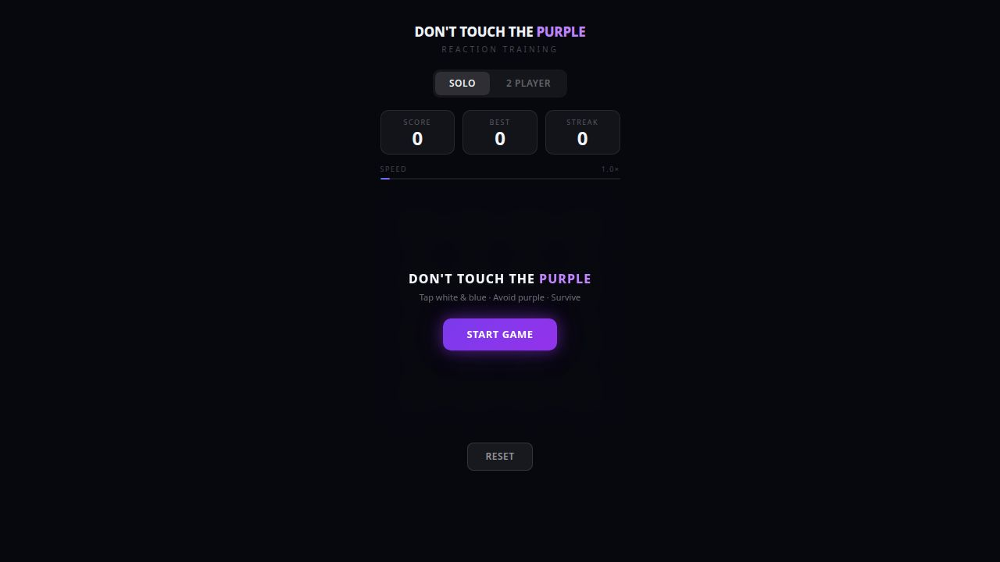

<div align="center">

# Don't Touch Purple

**A fast-paced reflex grid-tapping game. Tap every color except purple. How long can you survive?**

[](https://github.com/defaltadmin/donttouchpurple/actions/workflows/ci.yml)
[](https://nodejs.org)
[](https://www.typescriptlang.org)
[](https://vite.dev)
[](https://react.dev)
[](https://firebase.google.com)
[]()
[](LICENSE)

<a href="https://dont-touch-purple.web.app">
  
</a>

**[Play Now](https://dont-touch-purple.web.app)** | 
**[Wiki](https://github.com/defaltadmin/donttouchpurple/wiki)** | 
**[Design System](DESIGN.md)** | 
**[Agent Docs](llms.txt)**

</div>

---

## Game Modes

| Mode | Description |
|------|-------------|
| **Classic** | Race the clock. Tap every non-purple cell before time runs out. Miss a cell and time bleeds away. |
| **Evolve** | Survive the endless wave. The grid evolves, speeds up, and throws new mechanics at you. How far can you go? |

## Features

- **50+ achievements** across 8 categories — from casual to speedrun-tier
- **Daily objectives** with streak tracking and a rotating challenge seed
- **Global leaderboard** powered by Cloudflare Workers + Firebase
- **Bot assist mode** — toggle AI control for any player
- **12 WebGL backgrounds** — Nebula, Aurora, StarWarp, VoidTunnel, DigitalRain, Lightning, PulseField, and more (OGL)
- **Shop and currency** — earn dust, unlock backgrounds, badges, and themes
- **Challenge links** — share a seeded game with friends via URL
- **PWA installable** — works offline, feels native on mobile and desktop
- **Accessibility** — reduced motion, colorblind-safe palette, haptics toggle, screen shake control
- **Sentry + GameAnalytics** — real-time error tracking and player analytics

## Tech Stack

| Layer | Technology |
|-------|-----------|
| UI | React 18, TypeScript 5, CSS custom properties (MD3 tokens) |
| Build | Vite 7, Rollup, PostCSS |
| Backgrounds | OGL (WebGL), GSAP, Framer Motion, dotlottie-web |
| Backend | Firebase 12 (Auth, Firestore, Hosting, Analytics, App Check) |
| Workers | Cloudflare Workers (leaderboard proxy, score validation) |
| Testing | Vitest 4, Playwright (E2E) |
| CI/CD | GitHub Actions, semantic-release |
| Monitoring | Sentry, GameAnalytics, web-vitals |

## Quick Start

```bash
git clone https://github.com/defaltadmin/donttouchpurple.git
cd donttouchpurple
pnpm install
pnpm dev          # Opens http://localhost:5173
```

## Scripts

| Command | Description |
|---------|-------------|
| `pnpm dev` | Dev server with HMR |
| `pnpm typecheck` | TypeScript validation |
| `pnpm test` | Unit tests (Vitest) |
| `pnpm test:e2e` | End-to-end tests (Playwright) |
| `pnpm build` | Production build |
| `pnpm lint` | ESLint with auto-fix |
| `pnpm analyze` | Bundle size breakdown |

## Architecture

```
App.tsx (state machine)
  |- engine/           Pure game logic (zero React imports)
  |   |- GameEngine.ts    Core loop, scoring, session
  |   |- subsystems/      TickProcessor, CellLifecycle, boss events
  |   |- RNG, CellTypes
  |- components/       React UI layer
  |   |- Screens/         Menu, GameOver, Privacy, Settings
  |   |- HUD/             PlayerPanel, GameArea, PauseOverlay
  |   |- Backgrounds/     12 OGL/WebGL themes
  |   |- Shop/            ShopPanel, cosmetics
  |- hooks/            useGameEngine bridge, custom hooks
  |- services/         Firebase, Sentry, analytics
  |- workers/          Cloudflare Worker proxy
  |- config/           Balance, difficulty, patterns, powerup weights
  |- utils/            IDB queue, score-sync, privacy, achievements
```

## Documentation

| Doc | Description |
|-----|-------------|
| [DESIGN.md](DESIGN.md) | Design tokens, palette, typography, layout rules |
| [AGENTS.md](AGENTS.md) | Agent instructions, architecture, 8 domain-specific agent definitions |
| [llms.txt](llms.txt) | AI agent project overview |
| [llms-full.txt](llms-full.txt) | Full reference with APIs, config, and structure |
| [CHANGELOG.md](CHANGELOG.md) | Auto-generated release history |
| [Wiki](https://github.com/defaltadmin/donttouchpurple/wiki) | Game mechanics, modes, achievements, backgrounds, bot assist, leaderboard |

## Contributing

See [CONTRIBUTING.md](CONTRIBUTING.md) for dev setup, code style, and PR process.

## Security

See [SECURITY.md](SECURITY.md) for vulnerability reporting and supported versions.

## License

[MIT](LICENSE) - Copyright (c) 2025-2026 defaltadmin
